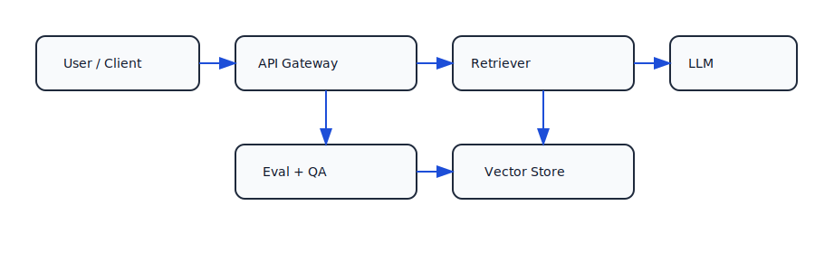
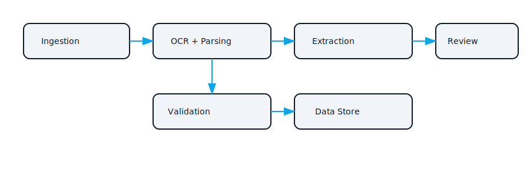

# Ahmed Ibrahim

Senior AI/ML Engineer • Tech Lead Track | LLM Systems • Document AI • MLOps

- 📍 Jeddah, Saudi Arabia → Abu Dhabi, UAE (planned around April, TBD)
- Building production-grade LLM systems with measurable quality (evals) and operational rigor (latency, observability)
- Open to: senior AI/ML • LLM platform • applied ML • tech lead roles

[Email](mailto:ahmed11elsaeed@gmail.com) · [LinkedIn](https://www.linkedin.com/in/ahmed-ibrahim-b290a2162/)

## Start here
1. **RAG API + eval harness** → [`rag-api-eval-starter`](https://github.com/aelsaeed/rag-api-eval-starter)  
   End-to-end retrieval, evaluation-first workflow, and quality gates.
2. **Document AI pipeline** → [`doc-ai-pipeline-starter`](https://github.com/aelsaeed/doc-ai-pipeline-starter)  
   Real-world PDF ingestion with OCR fallback, extraction, and validation.

## Portfolio (6 repos)

| Repo | What it demonstrates | Key features | How to run (1–2 commands) |
| --- | --- | --- | --- |
| [`rag-api-eval-starter`](https://github.com/aelsaeed/rag-api-eval-starter) | RAG API with evaluation-first workflow | Retrieval baselines, prompt + context controls, automated eval reports | `make up` → `make eval` |
| [`doc-ai-pipeline-starter`](https://github.com/aelsaeed/doc-ai-pipeline-starter) | Document AI from ingest to verification | OCR fallback, schema extraction, confidence scoring + validation | `make run` → `make test` |
| [`mlops-train-register-serve`](https://github.com/aelsaeed/mlops-train-register-serve) | Model lifecycle with repeatable training | MLflow tracking/registry, scripted promotion, deployable artifact | `make train` → `make serve` |
| [`otel-microservice-lab`](https://github.com/aelsaeed/otel-microservice-lab) | Observability in a microservice system | traces + metrics + structured logs, dashboards, SLO-minded instrumentation | `make up` |
| [`dagster-gx-pipeline`](https://github.com/aelsaeed/dagster-gx-pipeline) | Data pipeline with quality gates | Dagster assets + lineage, GX expectations/checkpoints | `make dev` |
| [`llm-serving-gateway-bench`](https://github.com/aelsaeed/llm-serving-gateway-bench) | LLM serving and gateway performance | rate limiting, caching, load tests, latency/throughput reporting | `make up` → `make bench` |

  
<strong>Architecture snapshots</strong>

  
  

## Private work note
Most of my employer work is private or under NDA. These public repos are representative samples that emphasize production constraints: evaluation, reproducibility, and observability in real systems.

## Engineering principles
- Measure quality with explicit evals before optimizing prompts or models.
- Make builds reproducible: pinned deps, one-command setup, deterministic configs where practical.
- Prefer simple, testable interfaces over clever abstractions.
- Bake in observability: traces, metrics, and structured logs from day one.
- Treat security as a default: secrets hygiene and least-privilege configs.
- Automate the boring parts with CI and quality gates.

## Tech stack
- **LLM/RAG:** LLM APIs, vector DBs, rerankers, eval harnesses
- **MLOps:** MLflow, model registries, CI/CD, containerized training/inference
- **Data:** Dagster, Great Expectations, DuckDB, Postgres
- **Backend:** FastAPI, gRPC, Python services
- **Observability:** OpenTelemetry, Prometheus, Grafana
- **Cloud:** AWS, Docker, Terraform

## Pinning suggestion
Pin these repos in this order:
1. `rag-api-eval-starter`
2. `doc-ai-pipeline-starter`
3. `mlops-train-register-serve`
4. `dagster-gx-pipeline`
5. `otel-microservice-lab`
6. `llm-serving-gateway-bench`
